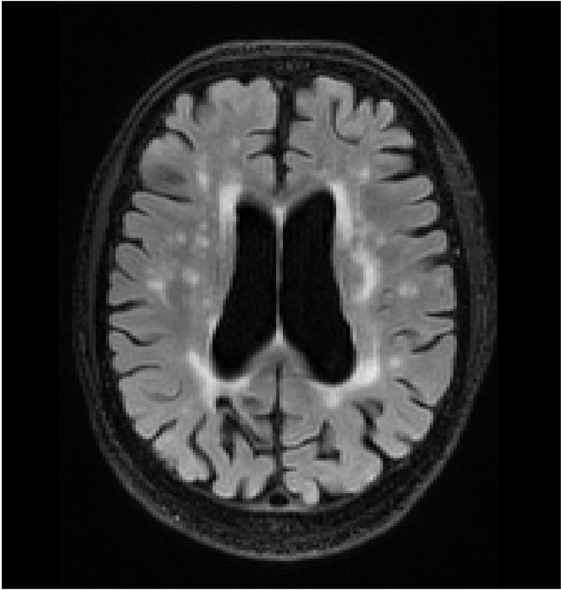
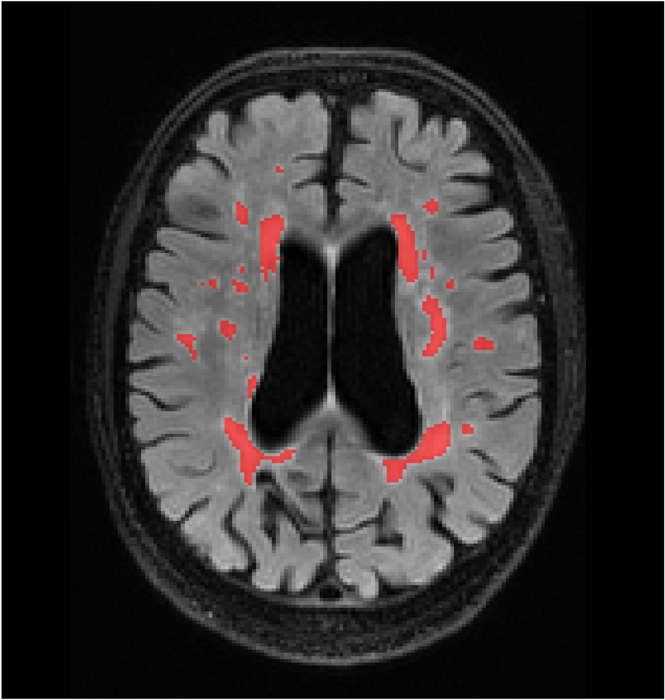

## The best-performing algorithm in the WMH segmentation challenge at MICCAI 
This repository provides codes, models, and containers for white matter hyperintensity segmentation in brain MR images with deep learning. 
(The latest update was made on 03 November 2025 🔥)
### Use our pre-trained models for your MRI data (CPU only)
We provide two types of models to support two types of inputs: (1) FLAIR-only image, and (2) FLAIR/T1 images. The segmentation is done in the native resolution. 
We provide two options depending on your setup.

#### Option 1: Python 3.10 and Tensorflow
The test dataset is expected to be in [BIDS](https://bids.neuroimaging.io/index.html) format. You will see an example in the _input_dir_ folder.

To run the script, first, you could use [miniconda](https://askubuntu.com/questions/1240489/how-can-i-download-and-install-miniconda) to set up the virtual environment (Python version is 3.10 or higher).  
Second, inside the virtual environment, install the following packages via: 
```
pip install numpy==2.2.6 SimpleITK==2.5.2 scipy==1.15.3
pip install tensorflow==2.15.0
```
Then download the pre-trained models [here](https://drive.google.com/file/d/1zyRl2nzruts98gve0CPVYsEFZd_znzgy/view?usp=sharing) and place them to _model_ folder. You can perform segmentation (FLAIR-T1 input as the default) via: 

```
python test_tf2.py 
```

#### Option 2: Docker container
You could pull the container via: 

```
docker pull wmh_seg_tf:latest 
```
Similarly, you would need to prepare the dataset in [BIDS](https://bids.neuroimaging.io/index.html) format and then run the container to perform segmentation via: 
```
docker run --gpus all -v /your/loca/input_dir:/app/input_dir -v /your/local/output_dir:/app/output_dir
```
The output segmentation will be in "/your/local/output_dir" locally. 


Here is one segmentation example from the test set (GE3T, Subject 111) using the above models: 

<p align="center">
  
  
</p>

<p align="center">
  <em>Raw brain FLAIR image (left) vs segmentation mask (right)</em> from the test set (GE3T, Subject 111, slide 52)
</p>


### Citation
The detailed description of our method is published in [NeuroImage](https://arxiv.org/pdf/1802.05203.pdf). It is still very competitive 🔥, although it is 7-year-old, 2D U-Net based. Please cite our work if you find the codeis useful for your research. A more robust and accurate approach is to come. 
